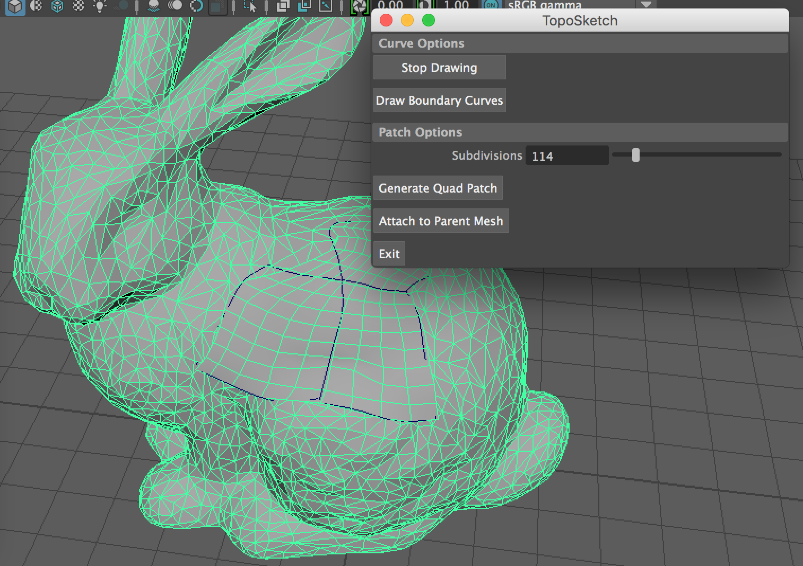

# TopoSketch
Sagar Tetali and Salaar Kohari  
CIS 660: Advanced Topics in Computer Graphics

Maya C++/MEL plugin to allow for sketch-based retopography based on existing SIGGRAPH research.

## Description
Artists want to retopologize meshes, often to quads, with control over subdivision levels. Take in any mesh (character, landscape, plane). User draws curves over the mesh to define patch boundaries. Generate quad mesh topography with user-specified subdivision level. Integrate the new patch into the provided mesh. Allows artists to intuitively retopologize 3D models with better edge flow control.

## Usage Details

Enable the plugin through Windows->Settings/Preferences->Plug-in Manager and browsing for the .mll file.  
The MEL Command to run the plugin is "TopoSketch".  
The MEL Script "StartStopTopo.mel" creates two global procedures "startTopoSketch" and "stopTopoSketch" when loaded.  
These files can be found in TopoSketch/Debug for now.

**startTopoSketch** - first checks the number of objects in the scene selected by the user.  
If only one object is selected, this procedure then makes that mesh live, and starts the CV Curve Tool operation to enable drawing curves on the mesh.  
Note: It is suggested you enable wireframe mode when doing this.

If more or no objects are selected, it throws an error.

**stopTopoSketch** - stops the topo sketch operation. 

This first checks if any objects are selected. If they are, it deselects all the objects and then invokes Make Not Live. 

Once the Script is Loaded, type "startTopoSketch" in the MEL command line or script editor to start sketching on the live mesh.

When you're done sketching, type "stopTopoSketch" in the MEL Command Line or Script Editor to stop sketching, deselect all objects, and make the mesh Not Live. 
